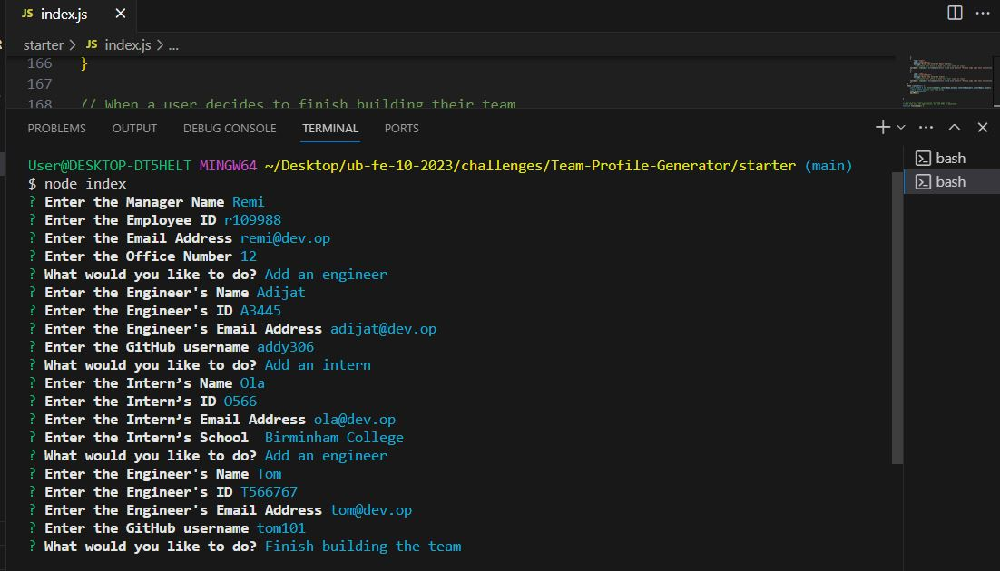
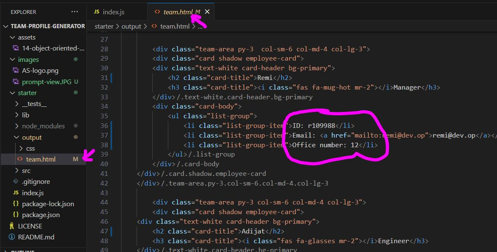
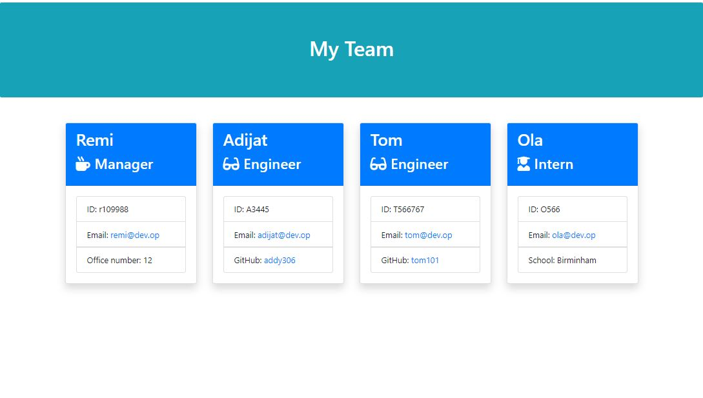
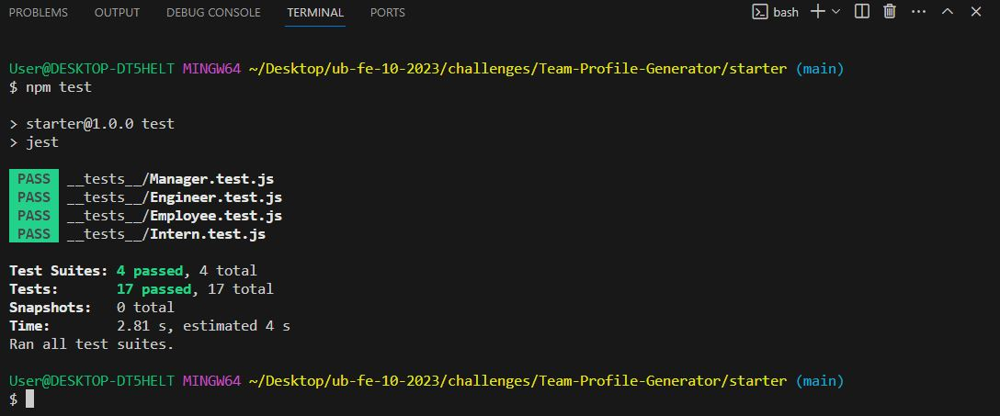
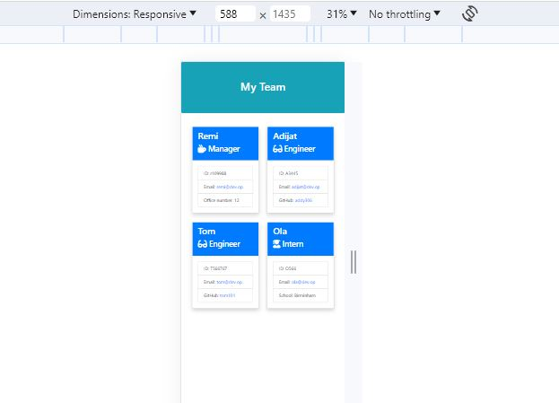

# Team-Profile-Generator


<!-- Developer Signature and github details -->
<br />
<div align="center">
  <a href="https://addy306.github.io/Team-Profile-Generator/">
    
  </a>
  </div>


## Deployed page URL
[Team-Profile-Generator](https://addy306.github.io/Team-Profile-Generator/)

## Project GitHub Repo URL
[Project GitHub repository](https://github.com/addy306/Team-Profile-Generator)


## Description
In this project I created a command-line application that dynamically generates a HTML webpage that displays summaries for each person. This application will take in information about employees on a software engineering team from a user's input using the Inquirer package.
Will make sure every part of my code passes each provided test.


## Table of Contents
- [Installation](#installation)
- [Usage](#usage)
- [License](#license)
- [Contribution](#contribution)
- [Tests](#tests)
- [Questions](#questions)

<!-- Add installation instructions here -->
## Installation 
npm i

<!-- Add usage information here -->
## Usage 
The application will be invoked by using the following command:

```bash
node index.js
```

## Webpage Features
### Screenshots, Videos, GIF

### Screenshot of commandline


### Screenshot of HMTL GENERATED FILE


### Screenshot of commandline


### Screenshot of npm test result


### Screenshots of responsive view



## License
This project is licensed under the MIT License - see the [LICENSE](LICENSE) file for details.

<!-- Add contributing guidelines here -->
## Contributing
Feel free to contribute to make it better.

<!-- Add information about how to run tests here -->
## Tests 
npm test

## Built With
* Javascript
* node.js
* inquirer
* jest 
* npm
* Bootstrap


## Questions
If you have any questions, feel free to contact me:
- GitHub: [addy306](https://github.com/addy306)
- Email: adijatworkdoc@gmail.com
